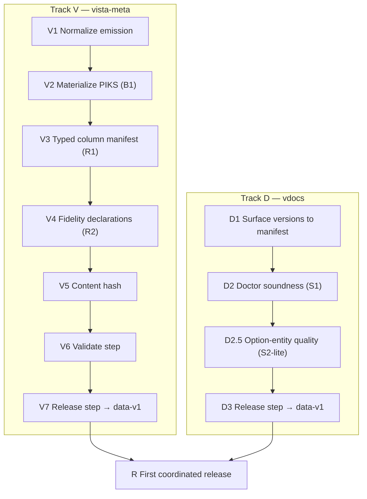

# Producer Contracts — Implementation Plan

> **EXECUTED (closed 2026-07-04).** Every vista-meta step landed with a gate-PASS commit —
> V1 f1e9d33 · V2 6e7b5c5 · V3 f73b2d4 · V4 b119bd1 · V5 a13070b · V6 5631e8c ·
> V7 8e9b447/f04b36b · Gate-R a27e04a. The vdocs-side Track D closed in the vdocs repo;
> the mutual pin is recorded in `../releases/data-v1-peers.json`. The living contract this
> plan produced is `../reference/schema-v1-normalization-spec.md`. Do not execute.

Sequenced plan to make **vista-meta** and **vdocs** emit pinned, versioned, review-passing
artifacts per the finalized specs (normalization spec incl. B1/R1–R4, publication contract,
adversarial review). Scope: **producers only** (the consumer build — Compass/Atlas — is a
separate plan). No code; no time estimates. Sequence, dependencies, and acceptance gates only.

Authoritative inputs (final): vista-meta schema v1 + addendum + normalization spec;
vdocs index.db schema; publication contract; adversarial review.

> **Amended 2026-07-03** per the measured adversarial review
> (vista-cloud-dev `docs/proposals/considering/vista-meta-hardening-adversarial-review.md`):
> V1 widened (%-routine census R4, files.tsv column cleanup, per-producer LF, 24-file
> count); V2 gains conflict red-gate + subfile inheritance; V3 gains cross-producer key
> targets; V4 reworded to static-call authority; V6 assertions widened; V7 gains engine
> pinning (R3) + raw-intermediate archival; Track D gains D2.5 (option-entity quality).

> **Amended 2026-07-03 (final adversarial pass, F1–F16 in §Risk register below; all
> findings re-measured against the live TSVs and live `index.db`):** V1 becomes a
> single-run re-emission with %-census boundary + in-repo-reader migration; V2
> inheritance made transitive + orphan-gated (measured: 17 of the 141 nest, 4 point at
> parents absent from files.tsv — plain single-pass inheritance does NOT reach 100%);
> V4 gains xindex-coverage declaration (29,098 of 39,330 routines have xindex rows);
> V5 hash recipe made normative; V6 gains cross-file referential integrity; V7
> manifest self-reference resolved + immutability reworded to verifiability; D2.5
> gains the quarantine cascade (measured: 1,169 entity_mentions + 3,826 relations
> reference option entities) and enumerates all 9 entity types; D-track measurements
> pinned to `corpus_content_hash` (live `read_schema_version` is already **1.4**, not
> the 1.0 the review vintage saw — the lake moves).

---

## Principles
- **Two parallel tracks** (vista-meta / vdocs) that converge on a first coordinated release.
- Each step has an **acceptance gate**; a step is done only when its gate passes.
- **No consumer is pinned yet**, so all freezing-relevant changes land now, in one v1.
- Nothing is "released" until its producer's **validate gate** passes.

---

## Track V — vista-meta

### V1 — Normalize emission
Apply the normalization spec's mechanical + naming changes to what the producers emit:
routine-identifier renames (`routine`/`name` → `routine_name`, `caller_name` →
`caller_routine`), `size_bytes` → `byte_size`, `_label` columns for integer enums, `Y/N`
booleans (blank = null), LF endings **in every emitting producer** (measured: 12 of 24
TSVs CRLF, the xindex family itself split — at least two toolchains), deterministic row
sort by PK, drop the comprehensive CSV, drop/populate files.tsv's empty classification
columns, and **extend the routine census to the %-namespace (R4)** — measured: 39,330
routines, zero %-routines, `is_percent_routine` vestigial; inclusion lifts the vdocs
routine join rate from 57.7% toward high-90s.
Three constraints added by the final pass (F7/F10/F11/F12/F14):
- **Single-run emission.** The 24 files are today built by independent make targets at
  independent times (vintage skew); v1 is **one full re-emission from one engine state**,
  captured under R3 from the start — normalization is not applied to the existing mixed-
  vintage files.
- **%-census boundary.** On YDB, `$ZRO` includes `$ydb_dist` — the census walk must take
  %-routines from the VistA-M tree / file 9.8 **only**, never sweep YottaDB's own
  `_*.m` utilities in; and each %-routine needs a declared package attribution rule
  (the `%` prefix is absent from the namespace map today).
- **In-repo readers migrate in the same change.** The VSCode extension (`hover.ts`,
  `routine.ts`) and `host/scripts/*` read the pre-normalization names (`routine`,
  `caller_name`, `size_bytes`) — "no consumer is pinned" does not cover the repo's own
  two shipped products.
- **Sort collation declared:** bytewise (`LC_ALL=C`) on the raw key string — "sorted by
  PK" alone is nondeterministic across implementations for decimal file numbers.
**Depends on:** nothing. **Gate:** all **24** files emit from a single run with
normalized headers, LF, bytewise-sorted rows; CSV absent; %-routines present with
`is_percent_routine=Y`, zero `$ydb_dist`-origin rows, every row package-attributed;
extension tests + CLI smoke pass against the normalized files; the old/new comparison
is **mechanical** (column sets, row counts, key sets — a plain diff is meaningless
across the resort), showing only the intended column/format/census changes.

### V2 — Materialize PIKS (B1)
Merge `piks-triage.tsv` into `piks.tsv` at emit time (triage wins); add `piks_source`
(`auto`/`triage`/`inherited`); retain triage file as provenance. **Conflicting triage rows
red-gate the merge** (measured live: file 107.3 twice with contradictory
method/confidence — resolve in triage, re-run; never silently pick). **Unclassified
subfiles inherit their parent's PIKS** (`piks_source=inherited`) — measured: all 141
uncovered files are subfiles. Final-pass corrections (F4) — single-pass inheritance
does **not** close coverage:
- **Transitive:** 17 of the 141 have parents that are themselves uncovered (e.g.
  64.701–64.707 under uncovered parents) — inherit through the parent chain
  (topological, cycles impossible in FM subfile nesting but guard anyway).
- **Orphans red-gate:** 4 of the 141 (500004.01, 5555555.01/.02, 655.01) point at
  `parent_file` values with **no row in files.tsv** — inheritance is impossible; these
  fail the merge loudly and are resolved in triage (they look like local/test files),
  never silently defaulted.
- **Precedence per file, after closure:** triage > auto > inherited.
**Depends on:** V1. **Gate:** `piks.tsv` carries EXACTLY one row per file_number in
files.tsv (coverage ≡, PK-unique) with correct `piks_source`; every triage record is
reflected; the merge fails loudly on a seeded triage conflict, a seeded nested-orphan
chain, and a seeded missing-parent subfile.

### V3 — Typed column manifest (R1)
Emit a per-file column manifest as data: each column's `name`, `type`, `nullable`,
`key_role` (pk/fk→target/none), reflecting the post-V1/V2 columns (incl. `piks_source`, `_label`).
`key_role` fk targets may name **cross-producer vocabularies** (`routine_name`,
`file_number`, option `name`, rpc `name` — the keys vdocs entities join against): the
thin, non-deferred slice of the entity-identity contract.
**Depends on:** V1, V2 (columns must be final). **Gate:** manifest lists every column of every
file in emit order; a mechanical check confirms manifest ≡ actual headers.

### V4 — Fidelity declarations (R2)
Record in the schema doc/manifest: `callee_routine` FKs are **open-world** (~2.3% unresolved,
external routines); call-graph diverges from XINDEX for ~7% of routines with **XINDEX
authoritative for *statically expressed* calls** — indirection (`DO @X`), XECUTE, and
option/protocol/RPC dispatch are declared **out of scope**, not covered (line/tag counts
agree 100%). *Added (F9):* declare the **xindex family's coverage scope** — the xindex
TSVs today describe 29,098 of 39,330 census routines (74%); which subset, and why, must
be stated the same way open-world FKs are; and the divergence denominator must say
whether %-routines (R4, likely not XINDEX-able the same way) are in or out.
**Depends on:** V1. **Gate:** all three declarations present and the stated rates re-measured against
the current emission (not stale numbers — the R4 census change moves the open-world rate
and the xindex coverage ratio).

### V5 — Content hash
Compute a data fingerprint over the sorted TSV set (mirrors vdocs `corpus_content_hash`).
**Recipe is normative, not an "e.g." (F13):** `content_hash` = sha256 over the
LF-joined lines `"<filename>\t<sha256(file-bytes)>"`, filenames included and sorted
bytewise; scope = the **24 data TSVs only** — the typed column manifest and
`manifest.json` are excluded, so a manifest-only correction does not move data
identity (bundle-level integrity is `bundle_sha256`'s job, V7).
**Depends on:** V1–V4 (hash covers final bytes). **Gate:** identical inputs → identical
hash; any single-file change → changed hash; a filename change with identical bytes →
changed hash; two independent implementations of the recipe agree.

### V6 — Validate step (doctor-equivalent)
A pre-release check asserting: file set ≡ typed manifest (all **24** files, no extras — a
count drift like the 23-vs-24 finding fails here); headers ≡ typed manifest (R1); **PK
uniqueness** on every declared pk (would have caught the live piks.tsv 107.3 duplicate);
**piks coverage ≡ files.tsv** (B1); **per-row column-count consistency** (tab-in-value
guard — currently clean, now gated); enum values ∈ documented sets (open-world tolerated
with a warning); booleans ∈ {Y,N,blank}; LF + sorted (bytewise); PIKS materialized;
**engine-identity fields present in the manifest** (R3); and — added by the final pass
(F8), now feasible post-R4 — **cross-file referential integrity**: every
`caller_routine`/`routine_name` in the edge and xindex files ∈ the routines census,
`routines-comprehensive` keys ≡ `routines` keys (both 39,330 today), every `package` ∈
packages.tsv, every `field-piks` file_number ∈ files.tsv. This is also the check that
catches **vintage skew** (files emitted from different engine states) — the failure
mode the old per-target Makefile emission invites.
**Depends on:** V1–V5. **Gate:** validate passes on a good emission and **fails loudly** on
seeded defects (a duplicated PK, a stray CRLF, a manifest/header mismatch, a missing piks
row, a ragged row, absent engine fields, an edge row naming a routine outside the census).

### V7 — Release step → data-v1
Assemble the export tree + typed manifest + `manifest.json` (contract fields incl.
`schema_version=1`, `content_hash`, `source_commit`, per-file sha256,
**and the R3 engine-pinning fields: `engine`, engine image digest / instance id,
extraction timestamp, DB-state fingerprint** — without these, `source_commit` pins code
that describes unidentifiable data) → `vista-meta-data-v1.tar.gz`; publish as GitHub
Release tagged `data-v1` with bundle + standalone manifest + `SHA256SUMS`.
Final-pass corrections (F5/F6/F7/F16):
- **`bundle_sha256` lives outside the bundle.** A manifest inside the tarball cannot
  carry the hash of the tarball that contains it. Two manifest variants: the
  **in-bundle** manifest (all fields except `bundle_sha256`) and the **standalone**
  release-asset manifest (= in-bundle fields + `bundle_sha256`), plus `SHA256SUMS`.
- **"Immutable" is a policy, not a GitHub property** — the owner can move tags and
  replace assets. Enforceable form: tag-protection rule + the standalone manifest's
  hashes **recorded in-repo** (committed after publish) so any later tampering is
  detectable by consumers, who verify `bundle_sha256` anyway.
- **R3 is captured at extraction time, not reconstructed.** The current TSVs came from
  a sandbox whose digest/state is likely unrecoverable — another reason V1 is a fresh
  single-run emission (the R3 fields cannot be retrofitted onto the existing files).
- **Clean-tree assertion:** the release step fails unless the working tree is clean and
  `HEAD` = `source_commit` = a pushed commit — else `source_commit` lies.
**Also archive the raw extraction intermediates** with the release: any future
re-emission (including the v-db graduation's content-hash-equality gate) must run from
the archived extraction, never by re-extracting a live engine — measured drift proves a
live engine can never hash-match. (Check intermediate size against GitHub's 2 GiB
per-asset limit; split the archive if needed. VEHU is synthetic/public training data,
but the archive rule stays metadata-level: no patient-record global dumps.)
**Depends on:** V6. **Gate:** a clean checkout can download, verify `bundle_sha256`
against both the standalone manifest and the in-repo record, and unpack to a
validate-passing tree whose manifest identifies its source engine and state.

---

## Track D — vdocs (parallel; largely wrapper work)

### D1 — Surface versions to the external manifest
Emit `manifest.json` surfacing the existing `read_schema_version` and
`corpus_content_hash` into the contract manifest shape (same fields as vista-meta).
*(F1: the review vintage read 1.0; the live `index.db` already says **1.4** with 1,034
docs — the manifest reads the live values at emit, never a hardcoded number, and the
plan makes no assumption about which minor version ships.)*
**Depends on:** nothing. **Gate:** manifest carries both version axes matching the values inside
`index.db` at assembly time.

### D2 — Doctor soundness extension (S1)
Extend `doctor` beyond structure to data soundness: exactly one `is_latest` anchor per version
group; `chunks_fts` populated; `entity_mentions` resolve to `entities`. *(F2: the
resolution check must be consistent with D2.5's quarantine — see the cascade rule there;
doctor runs after quarantine and must pass on the shipped table set.)*
**Depends on:** nothing (independent of D1). **Gate:** doctor passes on a good `index.db` and
fails on a seeded mis-anchor / empty FTS / dangling mention.

### D2.5 — Option-entity quality (S2-lite; added 2026-07-03)
Measured: only **1.6%** of vdocs `option`-type entities join to real option names — the
extraction produces mostly prose noise ("PATH EXAMPLE", "FOR FURTHER INFORMATION"). Full
S2 (entity-quality measurement) stays post-release, but option entities cannot ship
as-is in a pinned artifact: either **quarantine the type** (exclude `type=option` from
`entities` at emit, declared in the manifest) or fix the extractor against the
authoritative option-name vocabulary (vista-meta `options.tsv` — the R1 cross-producer
key target). Routine/file/rpc types measured healthy (57.7→high-90s post-R4 / 85.3% /
73.0%) and ship. Final-pass corrections (F2/F3/F1):
- **Quarantine cascades.** Excluding `type=option` from `entities` alone strands
  measured live: **1,169 `entity_mentions`** and **3,826 `relations`** rows referencing
  option entity ids — a quarantined type is removed from every referencing table
  (`entity_mentions`, `relations`, `chunk_entities`/skeleton, synonyms) at emit, or D2's
  doctor fails by construction.
- **All 9 types enumerated, not 4.** The live `entities` table also holds `global`
  (3,593), `build` (263), `mail_group` (43), `hl7_segment` (23), `package_namespace`
  (19). The gate as previously worded could not be evaluated for them. Each type's
  manifest status is one of: *floor-verified* (against a named vocabulary — `global`
  has a natural one in vista-meta `routine-globals.tsv`), *no-authoritative-vocabulary*
  (declared as unverified, e.g. `build`, `mail_group`, `hl7_segment`), or *excluded*.
- **Floors are numbers, not adjectives** — each floor-verified type declares its
  measured rate and its floor in the manifest.
- **Measured against the pinned corpus** (F1): all rates re-measured at gate time
  against the `corpus_content_hash` being released, and against the vista-meta v1
  vocabulary — the 2026-07-03 numbers were taken on an older lake vintage.
**Depends on:** nothing hard, but the join-rate measurements consume the vista-meta v1
candidate TSVs (post-R4) — so D2.5's *final* numbers land after V1, a soft cross-track
edge the convergence step absorbs. **Gate:** every entity type present in the released
`entities` table is enumerated in the manifest as floor-verified (rate ≥ declared
floor), no-vocabulary, or excluded; excluded types have zero residue in any referencing
table; doctor (D2) passes on the post-quarantine database.

### D3 — Release step → data-v1
Run doctor (D2) as a release gate; assemble `index.db` + gold corpus + `manifest.json`
→ `vdocs-data-v1.tar.gz`; publish as GitHub Release `data-v1` with bundle + standalone
manifest + `SHA256SUMS`. Final-pass corrections (F15/F5/F6):
- **Rich-assets decided, not open:** default **excluded** from data-v1 (gold corpus +
  `index.db` only), declared in the manifest; include-them is a v1.x additive follow-up.
- **Lake quiescence pre-flight:** the shared `~/data/vdocs` lake may host a live
  operator `vdocs run` — assembly requires no live run and `corpus_content_hash`
  unchanged across the assembly window, else two orchestrators race the very database
  being released.
- Same manifest-variant and verifiability rules as V7 (`bundle_sha256` outside the
  bundle; hashes recorded in-repo; clean tree at `source_commit`).
**Depends on:** D1, D2, D2.5. **Gate:** clean checkout downloads, verifies checksum
against standalone manifest + in-repo record, and `index.db` passes doctor.

---

## Convergence

### R — First coordinated release
Both producers have published `data-v1` releases that pass their validate/doctor gates and are
checksum-verifiable. The tracks are parallel except one soft edge: D2.5's final join-rate
measurements consume the vista-meta v1 candidate (post-R4 census) — so V1 precedes the
D2.5 *gate* even though D-track work starts immediately. Each manifest names the peer
artifact it was measured against (vista-meta `content_hash` ↔ vdocs
`corpus_content_hash`), making R a mutually-pinned pair, not two coincidental releases.
**Depends on:** V7, D3. **Gate:** a fresh environment can, with no repo
working tree, pull each `data-v1` artifact by tag, verify its `bundle_sha256`, and obtain a
validate/doctor-passing dataset — the exact operation the consumer build-prep will perform.

---

## Risk register (final adversarial pass, 2026-07-03)

All findings measured live before amendment; ordered by impact. **Status: applied** —
each F is folded into the step named in its mitigation.

| # | Assumption questioned | Finding (measured) | Impact if unmitigated | Mitigation (where) |
|---|---|---|---|---|
| F7 | "Normalization can be applied to the existing TSVs" | TSVs are emitted by independent make targets at independent times; the source sandbox's identity is likely unrecoverable | R3 fields unpopulatable; 24 files may describe ≥2 engine states (vintage skew) — the artifact lies about being one snapshot | v1 = one fresh single-run emission under R3 capture (V1, V7) |
| F4 | "Subfile inheritance closes coverage to 100%" | 17/141 uncovered subfiles have uncovered parents; 4/141 point at parents absent from files.tsv (500004, 5555555, 655) | Single-pass merge leaves gaps or silently mis-defaults; V2's own gate unreachable | Transitive inheritance + orphan red-gate + explicit precedence (V2) |
| F2 | "Quarantining option entities is a table filter" | 1,169 `entity_mentions` + 3,826 `relations` rows reference option entity ids | D2 doctor fails by construction the moment D2.5 quarantines; the two gates contradict | Quarantine cascades to all referencing tables; doctor runs post-quarantine (D2, D2.5) |
| F3 | "Entity quality = the 4 measured types" | `entities` holds 9 types; global (3,593), build (263), mail_group, hl7_segment, package_namespace were never measured | D2.5's gate literally cannot be evaluated; unverified types ship silently | Enumerate all 9; per-type status floor-verified / no-vocabulary / excluded (D2.5) |
| F5 | "manifest.json carries bundle_sha256" | A file inside the tarball cannot hold the tarball's hash | Contract is self-referentially impossible; implementer improvises | Two manifest variants: in-bundle (no bundle hash) + standalone (V7, D3) |
| F6 | "GitHub Releases are immutable" | Owner can move tags and replace assets | "Immutable" gate unenforceable; silent artifact swap undetectable | Tag protection + hashes recorded in-repo post-publish + consumer-side verify (V7, D3) |
| F1 | "index.db says read_schema_version 1.0" | Live value is **1.4**, 1,034 docs — the lake moved between review and now | Hardcoded manifest values wrong on day one; all D-track rates vintage-stale | Manifest reads live values; all D2.5 rates re-measured against the released `corpus_content_hash` (D1, D2.5) |
| F14 | "No consumer is pinned yet" | VSCode extension (`hover.ts`, `routine.ts`) + `host/scripts/*` read `routine`/`caller_name`/`size_bytes` | The repo's own two shipped products break at V1 | In-repo readers migrate in the V1 change; extension tests + CLI smoke in the V1 gate |
| F8 | "Structural checks suffice for validate" | Post-R4 the internal joins become closed-world-checkable; today nothing cross-checks files against each other | Vintage skew and census regressions pass validate | Cross-file referential integrity in V6 |
| F9 | "XINDEX describes the census" | xindex TSVs cover 29,098 of 39,330 routines (74%); scope undeclared; %-routines likely not XINDEX-able | Consumers read absence-of-findings as clean code | Coverage-scope declaration + divergence denominator defined (V4) |
| F10 | "%-census = walk more files" | On YDB `$ZRO` includes `$ydb_dist` (`_*.m` engine utilities); `%` absent from the package-namespace map | Census polluted with YottaDB library routines; un-attributed rows break per-package joins | Census boundary = VistA-M tree / file 9.8 only + attribution rule + gate assertion (V1) |
| F13 | "Hash of per-file hashes, e.g." | Recipe, filename inclusion, and manifest-in-or-out were unspecified | Irreproducible hash across implementations; V5's gate untestable | Normative recipe; TSVs only; filename-sensitivity in the gate (V5) |
| F12 | "Sorted by PK is deterministic" | Decimal file numbers (107.3) sort differently numeric vs bytewise | Byte-reproducibility breaks across producer implementations | Declared bytewise (`LC_ALL=C`) collation (V1, V6) |
| F11 | "A diff shows only intended changes" | The resort makes plain diff useless as evidence | V1's gate not mechanically checkable | Canonicalized comparison: column sets, row counts, key sets (V1) |
| F15 | "The lake is available for assembly" | Shared `~/data/vdocs` lake; operator runs race state.db/index.db | Release assembled from a mid-mutation database | Quiescence pre-flight + hash-stable assembly window (D3) |
| F16 | "source_commit identifies the producer" | Nothing required a clean tree or pushed commit at release time | `source_commit` can name a commit that didn't produce the artifact | Clean-tree + HEAD=source_commit=pushed assertion (V7, D3) |

**Assumptions questioned and left standing (no change):** TSV-without-escaping (re-verified
clean, and now gated by V6 ragged-row check); timestamps inside TSVs are source-derived
(compiled-routine comments), not emission-time, so determinism holds; the review's
measured claims (12 CRLF files, 39,330/zero-% census, 107.3 conflict, 141-subfile gap,
24-file count) all re-verified exactly; the review document's cited path in
vista-cloud-dev exists.

---

## Definition of done (producer contracts)
- vista-meta emits normalized `schema_version 1` with **B1/R1–R4** satisfied (incl.
  engine-pinned manifest + archived raw intermediates), a passing validate step, and an
  immutable `data-v1` GitHub Release with manifest + checksums.
- vdocs emits `data-v1` with a soundness-checking doctor gate, **all nine** entity types
  enumerated with a declared status (floor-verified / no-vocabulary / excluded, with
  cascaded quarantine) (D2.5), and the same release shape.
- Both artifacts are pin-able and checksum-verifiable by an external consumer, each
  manifest identifies its upstream source (engine+state / corpus hash), and each names
  the peer artifact it was measured against — the symmetry that makes the two producers
  peers.

## Explicitly out of scope (separate plans)
- Consumer build (Compass extraction/rebrand/data-decoupling; Atlas).
- Org/publisher registration (`vista-fusion`), Marketplace/Open VSX publishing.
- Cross-producer entity-identity contract (deferred by decision) — **except** the thin
  slice pulled forward 2026-07-03: R1 manifests declare the shared key vocabulary
  (V3), and D2.5 holds option entities to it.
- Remaining review followups beyond S1 (full S2 entity-quality measurement, S4
  value-identity, S5 enum open-world doc, cosmetics) — track separately; none block
  first release now that D2.5 carves out the one measured blocker (option entities).
- The provenance axis (national/local/runtime) — declared `schema_version 2` roadmap in
  the normalization spec §7; measured derivability floors recorded there.
