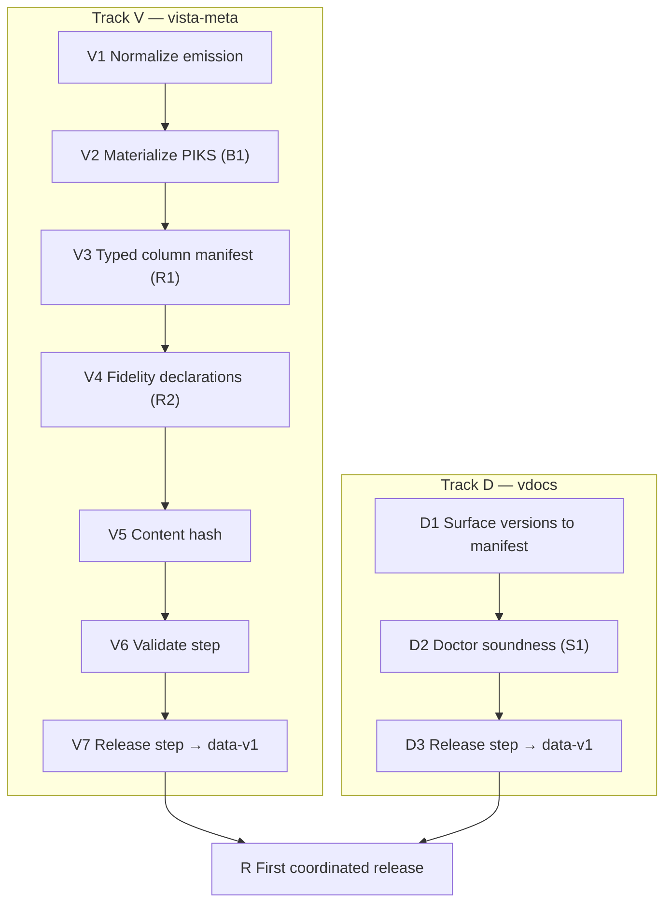

# Producer Contracts — Implementation Plan

Sequenced plan to make **vista-meta** and **vdocs** emit pinned, versioned, review-passing
artifacts per the finalized specs (normalization spec incl. B1/R1/R2, publication contract,
adversarial review). Scope: **producers only** (the consumer build — Compass/Atlas — is a
separate plan). No code; no time estimates. Sequence, dependencies, and acceptance gates only.

Authoritative inputs (final): vista-meta schema v1 + addendum + normalization spec;
vdocs index.db schema; publication contract; adversarial review.

---

## Principles
- **Two parallel tracks** (vista-meta / vdocs) that converge on a first coordinated release.
- Each step has an **acceptance gate**; a step is done only when its gate passes.
- **No consumer is pinned yet**, so all freezing-relevant changes land now, in one v1.
- Nothing is "released" until its producer's **validate gate** passes.

---

## Track V — vista-meta

### V1 — Normalize emission
Apply the normalization spec's mechanical + naming changes to what the producers emit:
routine-identifier renames (`routine`/`name` → `routine_name`, `caller_name` →
`caller_routine`), `size_bytes` → `byte_size`, `_label` columns for integer enums, `Y/N`
booleans (blank = null), LF endings, deterministic row sort by PK, drop the comprehensive CSV.
**Depends on:** nothing. **Gate:** all 23 files emit with normalized headers, LF, sorted rows;
CSV absent; a diff shows only the intended column/format changes.

### V2 — Materialize PIKS (B1)
Merge `piks-triage.tsv` into `piks.tsv` at emit time (triage wins); add `piks_source`
(`auto`/`triage`); retain triage file as provenance.
**Depends on:** V1. **Gate:** `piks.tsv` carries one authoritative row per file_number with
correct `piks_source`; every triage record is reflected; counts reconcile against both inputs.

### V3 — Typed column manifest (R1)
Emit a per-file column manifest as data: each column's `name`, `type`, `nullable`,
`key_role` (pk/fk→target/none), reflecting the post-V1/V2 columns (incl. `piks_source`, `_label`).
**Depends on:** V1, V2 (columns must be final). **Gate:** manifest lists every column of every
file in emit order; a mechanical check confirms manifest ≡ actual headers.

### V4 — Fidelity declarations (R2)
Record in the schema doc/manifest: `callee_routine` FKs are **open-world** (~2.3% unresolved,
external routines); call-graph diverges from XINDEX for ~7% of routines with **XINDEX
authoritative** for callees (line/tag counts agree 100%).
**Depends on:** V1. **Gate:** both declarations present and the stated rates re-measured against
the current emission (not stale numbers).

### V5 — Content hash
Compute a data fingerprint over the sorted TSV set (mirrors vdocs `corpus_content_hash`;
e.g. hash of per-file hashes). **Depends on:** V1–V4 (hash covers final bytes).
**Gate:** identical inputs → identical hash; any single-file change → changed hash.

### V6 — Validate step (doctor-equivalent)
A pre-release check asserting: all 23 files present; headers ≡ typed manifest (R1); PK
uniqueness holds; enum values ∈ documented sets (open-world tolerated with a warning);
booleans ∈ {Y,N,blank}; LF + sorted; PIKS materialized.
**Depends on:** V1–V5. **Gate:** validate passes on a good emission and **fails loudly** on
seeded defects (a duplicated PK, a stray CRLF, a manifest/header mismatch).

### V7 — Release step → data-v1
Assemble the export tree + typed manifest + `manifest.json` (contract fields incl.
`schema_version=1`, `content_hash`, `source_commit`, per-file sha256, `bundle_sha256`) →
`vista-meta-data-v1.tar.gz`; publish as GitHub Release tagged `data-v1` with bundle + standalone
manifest + `SHA256SUMS`. **Depends on:** V6. **Gate:** release is immutable; a clean checkout
can download, verify `bundle_sha256`, and unpack to a validate-passing tree.

---

## Track D — vdocs (parallel; largely wrapper work)

### D1 — Surface versions to the external manifest
Emit `manifest.json` surfacing the existing `read_schema_version` (**1.0**) and
`corpus_content_hash` into the contract manifest shape (same fields as vista-meta).
**Depends on:** nothing. **Gate:** manifest carries both version axes matching the values inside
`index.db`.

### D2 — Doctor soundness extension (S1)
Extend `doctor` beyond structure to data soundness: exactly one `is_latest` anchor per version
group; `chunks_fts` populated; `entity_mentions` resolve to `entities`.
**Depends on:** nothing (independent of D1). **Gate:** doctor passes on a good `index.db` and
fails on a seeded mis-anchor / empty FTS / dangling mention.

### D3 — Release step → data-v1
Run doctor (D2) as a release gate; assemble `index.db` + gold corpus (+ rich-assets if in
scope — open) + `manifest.json` → `vdocs-data-v1.tar.gz`; publish as GitHub Release `data-v1`
with bundle + standalone manifest + `SHA256SUMS`. **Depends on:** D1, D2. **Gate:** release
immutable; clean checkout downloads, verifies checksum, and `index.db` passes doctor.

---

## Convergence

### R — First coordinated release
Both producers have published `data-v1` releases that pass their validate/doctor gates and are
checksum-verifiable. **Depends on:** V7, D3. **Gate:** a fresh environment can, with no repo
working tree, pull each `data-v1` artifact by tag, verify its `bundle_sha256`, and obtain a
validate/doctor-passing dataset — the exact operation the consumer build-prep will perform.

---

## Definition of done (producer contracts)
- vista-meta emits normalized `schema_version 1` with B1/R1/R2 satisfied, a passing validate
  step, and an immutable `data-v1` GitHub Release with manifest + checksums.
- vdocs emits `data-v1` with a soundness-checking doctor gate and the same release shape.
- Both artifacts are pin-able and checksum-verifiable by an external consumer.

## Explicitly out of scope (separate plans)
- Consumer build (Compass extraction/rebrand/data-decoupling; Atlas).
- Org/publisher registration (`vista-fusion`), Marketplace/Open VSX publishing.
- Cross-producer entity-identity contract (deferred by decision).
- Remaining review followups beyond S1 (S2 entity-quality measurement, S4 value-identity,
  S5 enum open-world doc, cosmetics) — track separately; none block first release.
