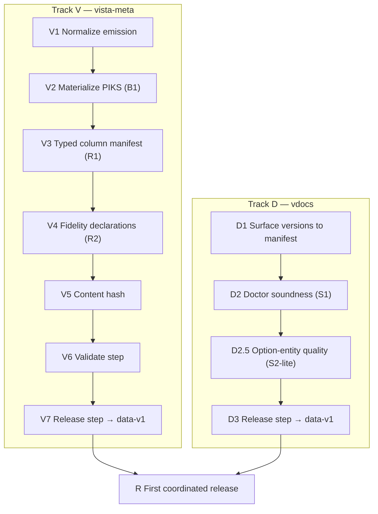

# Producer Contracts — Implementation Plan

Sequenced plan to make **vista-meta** and **vdocs** emit pinned, versioned, review-passing
artifacts per the finalized specs (normalization spec incl. B1/R1–R4, publication contract,
adversarial review). Scope: **producers only** (the consumer build — Compass/Atlas — is a
separate plan). No code; no time estimates. Sequence, dependencies, and acceptance gates only.

Authoritative inputs (final): vista-meta schema v1 + addendum + normalization spec;
vdocs index.db schema; publication contract; adversarial review.

> **Amended 2026-07-03** per the measured adversarial review
> (vista-cloud-dev `docs/proposals/considering/vista-meta-hardening-adversarial-review.md`):
> V1 widened (%-routine census R4, files.tsv column cleanup, per-producer LF, 24-file
> count); V2 gains conflict red-gate + subfile inheritance; V3 gains cross-producer key
> targets; V4 reworded to static-call authority; V6 assertions widened; V7 gains engine
> pinning (R3) + raw-intermediate archival; Track D gains D2.5 (option-entity quality).

---

## Principles
- **Two parallel tracks** (vista-meta / vdocs) that converge on a first coordinated release.
- Each step has an **acceptance gate**; a step is done only when its gate passes.
- **No consumer is pinned yet**, so all freezing-relevant changes land now, in one v1.
- Nothing is "released" until its producer's **validate gate** passes.

---

## Track V — vista-meta

### V1 — Normalize emission
Apply the normalization spec's mechanical + naming changes to what the producers emit:
routine-identifier renames (`routine`/`name` → `routine_name`, `caller_name` →
`caller_routine`), `size_bytes` → `byte_size`, `_label` columns for integer enums, `Y/N`
booleans (blank = null), LF endings **in every emitting producer** (measured: 12 of 24
TSVs CRLF, the xindex family itself split — at least two toolchains), deterministic row
sort by PK, drop the comprehensive CSV, drop/populate files.tsv's empty classification
columns, and **extend the routine census to the %-namespace (R4)** — measured: 39,330
routines, zero %-routines, `is_percent_routine` vestigial; inclusion lifts the vdocs
routine join rate from 57.7% toward high-90s.
**Depends on:** nothing. **Gate:** all **24** files emit with normalized headers, LF,
sorted rows; CSV absent; %-routines present with `is_percent_routine=Y`; a diff shows
only the intended column/format/census changes.

### V2 — Materialize PIKS (B1)
Merge `piks-triage.tsv` into `piks.tsv` at emit time (triage wins); add `piks_source`
(`auto`/`triage`/`inherited`); retain triage file as provenance. **Conflicting triage rows
red-gate the merge** (measured live: file 107.3 twice with contradictory
method/confidence — resolve in triage, re-run; never silently pick). **Unclassified
subfiles inherit their parent's PIKS** (`piks_source=inherited`) — measured: all 141
uncovered files are subfiles, so inheritance closes coverage to 100%.
**Depends on:** V1. **Gate:** `piks.tsv` carries EXACTLY one row per file_number in
files.tsv (coverage ≡, PK-unique) with correct `piks_source`; every triage record is
reflected; the merge fails loudly on a seeded triage conflict.

### V3 — Typed column manifest (R1)
Emit a per-file column manifest as data: each column's `name`, `type`, `nullable`,
`key_role` (pk/fk→target/none), reflecting the post-V1/V2 columns (incl. `piks_source`, `_label`).
`key_role` fk targets may name **cross-producer vocabularies** (`routine_name`,
`file_number`, option `name`, rpc `name` — the keys vdocs entities join against): the
thin, non-deferred slice of the entity-identity contract.
**Depends on:** V1, V2 (columns must be final). **Gate:** manifest lists every column of every
file in emit order; a mechanical check confirms manifest ≡ actual headers.

### V4 — Fidelity declarations (R2)
Record in the schema doc/manifest: `callee_routine` FKs are **open-world** (~2.3% unresolved,
external routines); call-graph diverges from XINDEX for ~7% of routines with **XINDEX
authoritative for *statically expressed* calls** — indirection (`DO @X`), XECUTE, and
option/protocol/RPC dispatch are declared **out of scope**, not covered (line/tag counts
agree 100%).
**Depends on:** V1. **Gate:** both declarations present and the stated rates re-measured against
the current emission (not stale numbers — the R4 census change moves the open-world rate).

### V5 — Content hash
Compute a data fingerprint over the sorted TSV set (mirrors vdocs `corpus_content_hash`;
e.g. hash of per-file hashes). **Depends on:** V1–V4 (hash covers final bytes).
**Gate:** identical inputs → identical hash; any single-file change → changed hash.

### V6 — Validate step (doctor-equivalent)
A pre-release check asserting: file set ≡ typed manifest (all **24** files, no extras — a
count drift like the 23-vs-24 finding fails here); headers ≡ typed manifest (R1); **PK
uniqueness** on every declared pk (would have caught the live piks.tsv 107.3 duplicate);
**piks coverage ≡ files.tsv** (B1); **per-row column-count consistency** (tab-in-value
guard — currently clean, now gated); enum values ∈ documented sets (open-world tolerated
with a warning); booleans ∈ {Y,N,blank}; LF + sorted; PIKS materialized;
**engine-identity fields present in the manifest** (R3).
**Depends on:** V1–V5. **Gate:** validate passes on a good emission and **fails loudly** on
seeded defects (a duplicated PK, a stray CRLF, a manifest/header mismatch, a missing piks
row, a ragged row, absent engine fields).

### V7 — Release step → data-v1
Assemble the export tree + typed manifest + `manifest.json` (contract fields incl.
`schema_version=1`, `content_hash`, `source_commit`, per-file sha256, `bundle_sha256`,
**and the R3 engine-pinning fields: `engine`, engine image digest / instance id,
extraction timestamp, DB-state fingerprint** — without these, `source_commit` pins code
that describes unidentifiable data) → `vista-meta-data-v1.tar.gz`; publish as GitHub
Release tagged `data-v1` with bundle + standalone manifest + `SHA256SUMS`. **Also archive
the raw extraction intermediates** with the release: any future re-emission (including
the v-db graduation's content-hash-equality gate) must run from the archived extraction,
never by re-extracting a live engine — measured drift proves a live engine can never
hash-match. **Depends on:** V6. **Gate:** release is immutable; a clean checkout can
download, verify `bundle_sha256`, and unpack to a validate-passing tree whose manifest
identifies its source engine and state.

---

## Track D — vdocs (parallel; largely wrapper work)

### D1 — Surface versions to the external manifest
Emit `manifest.json` surfacing the existing `read_schema_version` (**1.0**) and
`corpus_content_hash` into the contract manifest shape (same fields as vista-meta).
**Depends on:** nothing. **Gate:** manifest carries both version axes matching the values inside
`index.db`.

### D2 — Doctor soundness extension (S1)
Extend `doctor` beyond structure to data soundness: exactly one `is_latest` anchor per version
group; `chunks_fts` populated; `entity_mentions` resolve to `entities`.
**Depends on:** nothing (independent of D1). **Gate:** doctor passes on a good `index.db` and
fails on a seeded mis-anchor / empty FTS / dangling mention.

### D2.5 — Option-entity quality (S2-lite; added 2026-07-03)
Measured: only **1.6%** of vdocs `option`-type entities join to real option names — the
extraction produces mostly prose noise ("PATH EXAMPLE", "FOR FURTHER INFORMATION"). Full
S2 (entity-quality measurement) stays post-release, but option entities cannot ship
as-is in a pinned artifact: either **quarantine the type** (exclude `type=option` from
`entities` at emit, declared in the manifest) or fix the extractor against the
authoritative option-name vocabulary (vista-meta `options.tsv` — the R1 cross-producer
key target). Routine/file/rpc types measured healthy (57.7→high-90s post-R4 / 85.3% /
73.0%) and ship.
**Depends on:** nothing. **Gate:** every entity type present in the released `entities`
table either meets a declared join-rate floor against its authoritative vocabulary or is
excluded, and the manifest says which.

### D3 — Release step → data-v1
Run doctor (D2) as a release gate; assemble `index.db` + gold corpus (+ rich-assets if in
scope — open) + `manifest.json` → `vdocs-data-v1.tar.gz`; publish as GitHub Release `data-v1`
with bundle + standalone manifest + `SHA256SUMS`. **Depends on:** D1, D2, D2.5. **Gate:** release
immutable; clean checkout downloads, verifies checksum, and `index.db` passes doctor.

---

## Convergence

### R — First coordinated release
Both producers have published `data-v1` releases that pass their validate/doctor gates and are
checksum-verifiable. **Depends on:** V7, D3. **Gate:** a fresh environment can, with no repo
working tree, pull each `data-v1` artifact by tag, verify its `bundle_sha256`, and obtain a
validate/doctor-passing dataset — the exact operation the consumer build-prep will perform.

---

## Definition of done (producer contracts)
- vista-meta emits normalized `schema_version 1` with **B1/R1–R4** satisfied (incl.
  engine-pinned manifest + archived raw intermediates), a passing validate step, and an
  immutable `data-v1` GitHub Release with manifest + checksums.
- vdocs emits `data-v1` with a soundness-checking doctor gate, entity types held to a
  declared quality floor (D2.5), and the same release shape.
- Both artifacts are pin-able and checksum-verifiable by an external consumer, and each
  manifest identifies its upstream source (engine+state / corpus hash) — the symmetry
  that makes the two producers peers.

## Explicitly out of scope (separate plans)
- Consumer build (Compass extraction/rebrand/data-decoupling; Atlas).
- Org/publisher registration (`vista-fusion`), Marketplace/Open VSX publishing.
- Cross-producer entity-identity contract (deferred by decision) — **except** the thin
  slice pulled forward 2026-07-03: R1 manifests declare the shared key vocabulary
  (V3), and D2.5 holds option entities to it.
- Remaining review followups beyond S1 (full S2 entity-quality measurement, S4
  value-identity, S5 enum open-world doc, cosmetics) — track separately; none block
  first release now that D2.5 carves out the one measured blocker (option entities).
- The provenance axis (national/local/runtime) — declared `schema_version 2` roadmap in
  the normalization spec §7; measured derivability floors recorded there.
